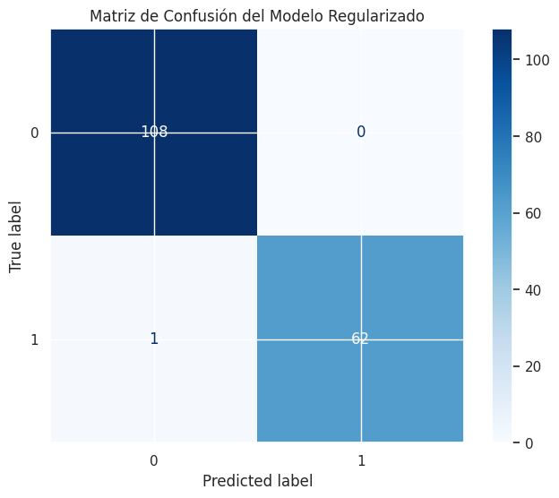

# Proyecto Final: Regresión Logística con Python y Scikit-Learn

Este proyecto implementa un modelo de **Machine Learning** para la clasificación de diagnósticos de cáncer de mama (Benigno/Maligno) utilizando el dataset Wisconsin Breast Cancer de Kaggle. Se enfoca en la limpieza de datos, análisis exploratorio, escalamiento y optimización de hiperparámetros.

Puedes encontrar el enlace al proyecto en Kaggle aquí: [Final Project](https://www.kaggle.com/code/erickluisflorespaz/final-proyect)

## Estructura del Proyecto

- `final-proyect.ipynb`: Notebook principal con todo el flujo de trabajo.
- `content/data.csv`: Conjunto de datos original.
- `.venv/`: Entorno virtual de Python.

## Metodología Aplicada

1.  **Limpieza de Datos**:
    - Mapeo de etiquetas categóricas (`M`, `B`) a numéricas (`1`, `0`).
    - Eliminación de columnas irrelevantes (`id`, `Unnamed: 32`).
2.  **Análisis Exploratorio (EDA)**:
    - Cálculo de matrices de correlación para identificación de variables con baja señal.
    - Visualización de distribuciones de características continuas mediante histogramas y densidades (KDE).
3.  **Preparación para Modelado**:
    - División del dataset en conjuntos de entrenamiento (70%) y prueba (30%).
    - Escalamiento de características con `StandardScaler` para garantizar el correcto funcionamiento de la regularización.
4.  **Optimización de Hiperparámetros**:
    - Uso de `GridSearchCV` con validación cruzada (5-fold).
    - Tuning de penalizaciones **L1 (Lasso)** y **L2 (Ridge)**.
    - Búsqueda del valor óptimo de `C` (inverso de la fuerza de regularización).

## Requisitos e Instalación

Asegúrate de tener instalado Python 3.x y las siguientes librerías:

```bash
pip install pandas numpy matplotlib seaborn scikit-learn
```

## Resultados obtenidos

El modelo final optimizado alcanza una alta precisión (_Accuracy de 99.42%_) en el conjunto de prueba, demostrando ser robusto gracias al uso de regularización y validación cruzada.

Se puede observar el desempeño del modelo en el conjunto de prueba en la siguiente matriz de confusión:

## 

_Desarrollado como práctica del Curso de Regresión Logística de Platzi._
